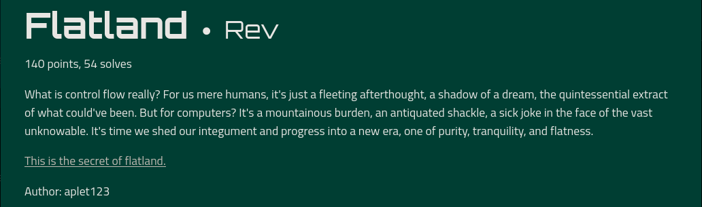
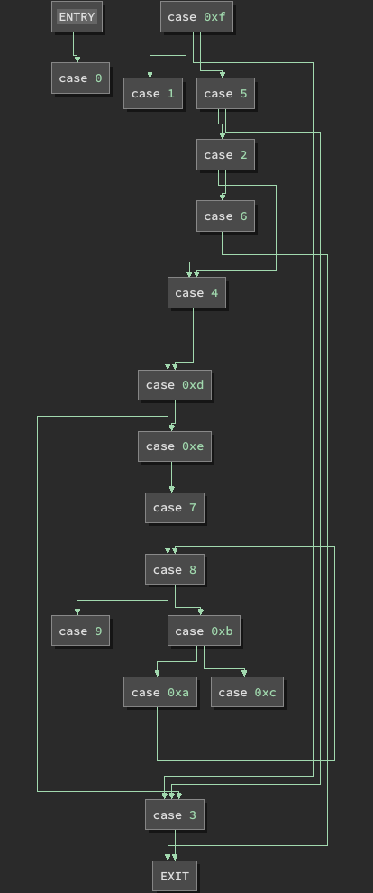
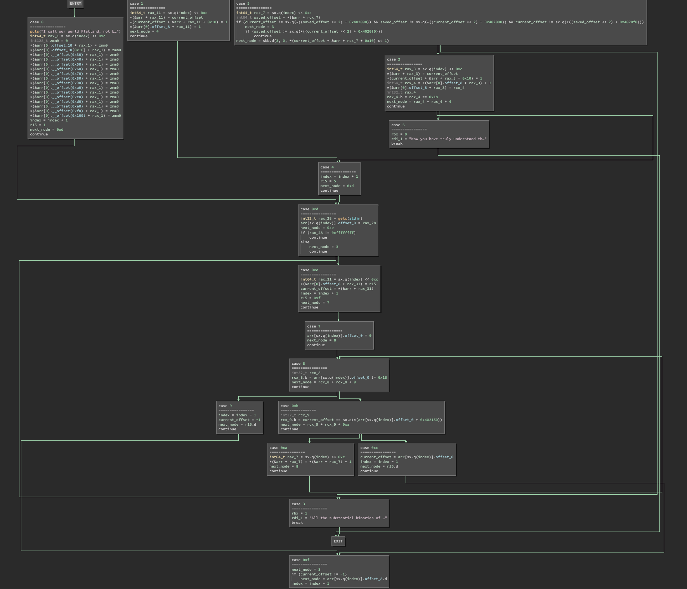
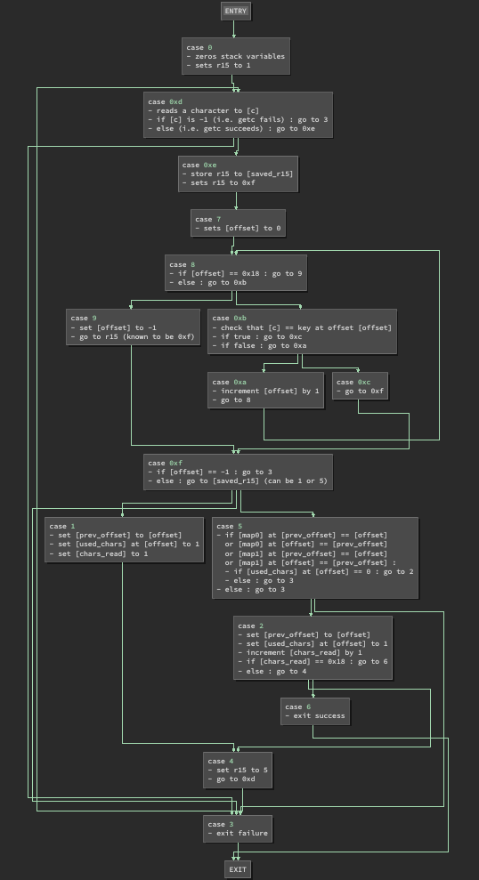

# Flatland



## Summary

- Use the Binary Ninja Python APIs to automate extracting to control flow of the program.
- Use the fixed CFG to reverse engineer the logic that validates a flag.
- Create a script to find the flag by checking possibly valid characters according to the validation logic.

A.k.a. overcomplicating a switch statement using Binary Ninja.

Also while I was doing this my teammates solved it with instruction counting...
but my method is cooler >:(

## Challenge

We're given an x86-64 binary to reverse engineer.

The binary is a flag checker.
We can enter a guess and determine whether or not the guess is correct based on the response of the program.

### Behaviour

Running the binary will greet us with the following message, then wait for user input:

> I call our world Flatland, not because we call it so, but to make its nature clearer to you, my happy solvers, who are privileged to have control flow.

If we enter a random input, we are given the following response:

> All the substantial binaries of Flatland itself appear no better than the offspring of a diseased imagination, or the baseless instructions of a CPU.

### Pseudo C (Generated by Binary Ninja)

This is an overview of the Pseudo C code for the `main()` function generated by Binary Ninja using the initial linear sweep analysis.

```c
00401140  int32_t main(int32_t argc, char** argv, char** envp) {
00401155      int32_t rbp = 0;

              // omitted some variable declarations

00401170      while (true) {
00401170          uint64_t rcx_1 = ((uint64_t)rax);
00401175          void var_64028;
00401175          void var_64020;
00401175          if (rax <= 0xf) {
00401177              switch (rcx_1) {
00401183                  case 0: {
00401183                      puts("I call our world Flatland, not b…");
0040118b                      int64_t rax_2 = (((int64_t)rbp) << 0xc);

                              // omitted code to set stack variables to zero

004011fd                      rbp = (rbp + 1);
00401200                      r15 = 1;
00401206                      rax = 0xd;
0040120b                      continue;
0040120b                  }
0040127c                  case 1: { ... }
00401213                  case 2: { ... }
004013cf                  case 3: { ... }
004012a0                  case 4: { ... }
004012b6                  case 5: { ... }
004013db                  case 6: { ... }
00401318                  case 7: { ... }
00401338                  case 8: { ... }
00401159                  case 9: { ... }
00401248                  case 0xa: { ... }
0040135e                  case 0xb: { ... }
00401373                  case 0xc: { ... }
0040138e                  case 0xd: { ... }
004013af                  case 0xe: { ... }
0040125b                  case 0xf: { ... }
00401271              }
00401271          }
00401175      }
004013e2      puts(rdi_1);
004013f6      return rbx_1;
004013f6  }
```

We can see that the body of the function is primarily a switch statement within a while loop.
Each case modifies RAX, which is used by the switch statement to determine which case to go to next.

From the start of the program, until the program exits, all code is contained within this while loop.
Program state is stored in a combination of registers and stack variables.
This greatly increases the difficulty of extracting the control flow of the program, as all branches are reachable from the same initial switch statement.

### Control Flow Graph (Generated by Binary Ninja)

As mentioned earlier, it is more difficult to recover the true control flow of the program due to the use of a central switch statement within the main loop.
The image below shows the CFG extracted by Binary Ninja (using Low Level IL).


As we can see, the central switch statement branches out to each of the 16 cases.
Most of these cases jump back to the beginning of the loop, which will reach the switch statement again and go to another block.

It would be very difficult, from this diagram alone, to determine how the program is checking a flag, as it appears that any node could lead to any other node.

## Solution

If we are able to recover the original control flow, we will have defeated a major source of the obfuscation and the program will be significantly easier to reverse engineer.

Before we begin, there are some important things to note about the program:

- All cases lead to the top of the loop or to the exit node.
- Any case which goes back to the top of the loop will set the RAX register beforehand.
- Some cases have branches within, which may result in a different RAX values.
- RBP is NOT the frame pointer, it is set to 0 at the start of the function and changes throughout the program.

### Extracting cases

The Binary Ninja Python API is very efficient at automating processes of this sort.
First, these are some useful handles we will be using to interact with Binary Ninja:

```py
# main function
main = bv.get_functions_by_name('main')[0]


# Mapped Medium Level IL SSA Form of the main function
ssa = main.mmlil.ssa_form
```

We are using Medium Level IL SSA Form as static single assignment will allow us to easily find the possible values of a variable.
This will be especially useful for determining which cases may be reached from a given block.
We are using Mapped mode so we can find the initial basic block of a case given a jump table destination, as the addresses of assembly instructions is mapped to the Medium Level IL lines in this mode.

To start reconstructing a control flow graph, we should first extract the individual cases that will act as the nodes of our graph.

```py
# dictionary containing a node and basic block for each case in the switch statement
cases = {}


# jump table used by the switch statement
jump_table = bv.get_data_var_at(0x402010).value


# graph used to display the reconstructed CFG
# entry_node and exit_note represent the entry and exit points of the program
graph = FlowGraph()

entry_node = FlowGraphNode(graph)
entry_node.lines = [f"ENTRY"]
graph.append(entry_node)

exit_node = FlowGraphNode(graph)
exit_node.lines = [f"EXIT"]
graph.append(exit_node)


# For each case in the switch statement:
# - Set the node
# - Set the initial basic block
for i in range(len(jump_table)):
    for block in ssa.basic_blocks:
        if block.start == ssa.get_instruction_start(jump_table[i]):
            node = FlowGraphNode(graph)
            graph.append(node)
            cases[i] = {
                    'block': block,
                    'node': node,
                    }
```

We may also want to display the code corresponding to these cases.
For the code displayed in each node, I chose High Level IL for two reasons:

- It is the most concise, so it will be easier to get a sense of how the program generally works from a CFG view.
- It is the easiest to parse cases from linear view, as the other views do not simplify branches within a case.

```py
# Add the case number and High Level IL instructions to each node
# This will be displayed on the graph
for x in main.hlil.instructions:
    if x.operation == HighLevelILOperation.HLIL_CASE:
        node = cases[x.operands[0][0].constant]['node']
        node.lines = list(x.lines)

        # whether or not to display HLIL code in a node
        if showInstructions:
            node.lines += ['='*16] + list(x.body.lines)
```

Now that we have mapped each case to its initial basic block and a node in our graph, we can parse these blocks to begin recovering control flow.

### Modeling control flow

We cannot simply check the end of the basic block for the value of RAX as some cases have subbranches.
To get all the possible next nodes for a case, we need to recursively analyze its blocks and get the possible values of RAX for each block that jumps back to the start of the loop.

The function below, `getPossibleRange(block)`, does exactly that.

```py
# All possible values for the next case number
# This should be a range of [0x0, 0xf]
possible_rcx = ssa[49].get_ssa_var_possible_values(ssa[49].vars_read[0]).ranges[0]


# Get the possible next nodes from a given block
def getPossibleRange(block):
    possible = set()

    # return an empty set if we reach the start of the loop
    if block.start == 13:
        return possible

    # return a set containing the exit_node if we reach the final block 
    if len(block.outgoing_edges) == 0:
        possible.add(exit_node)
        return possible

    # if the block has an immediate outgoing edge to the start of the loop
    # we need to check the possible values of RAX to determine the next node(s)
    if 13 in [edge.target.start for edge in block.outgoing_edges]:

        # iterate over the instructions in the block, starting at the bottom
        for i in range(block.end - 1, block.start - 1, -1):

            # get the last line (highest address) that modifies RAX
            if 'rax' in [x.name for x in ssa[i].vars_written]:
                possible_rax = ssa[i].get_ssa_var_possible_values(ssa[i].vars_written[0])

                # parse possible_rax to extract possible next nodes
                if hasattr(possible_rax, 'ranges'):
                    for rax_range in possible_rax.ranges:

                        # restrict the possible range to be within possible values of RCX
                        # i.e. only existing cases are possible next nodes
                        bounded_start = max(rax_range.start, possible_rcx.start)
                        bounded_end = min(rax_range.end, possible_rcx.end)
                        possible.update([cases[ii]['node'] for ii in range(bounded_start, bounded_end + 1, rax_range.step)])
                elif hasattr(possible_rax, 'values'):
                    possible.update([cases[ii]['node'] for ii in possible_rax.values])
                else:
                    possible.add(cases[possible_rax.value]['node'])

                break

    # recurse over outgoing edges and update the possible set
    for edge in block.outgoing_edges:
        possible.update(getPossibleRange(edge.target))

    # return the possble next nodes according to this block
    return possible
```

We will find that the graph produced by the code above is far too general to be of any use.
For now, let's hide the outgoing edges for cases where the next node can be any node.

```py
# in def getPossibleRange(block):

...

if hasattr(possible_rax, 'ranges'):
    for rax_range in possible_rax.ranges:
        bounded_start = max(rax_range.start, possible_rcx.start)
        bounded_end = min(rax_range.end, possible_rcx.end)

        # Exclude outgoing edges if the node is underconstrained
        if bounded_start <= 0 and bounded_end >= 0xf:
            continue

        possible.update([cases[ii]['node'] for ii in range(bounded_start, bounded_end + 1, rax_range.step)])

...
```

This will give us only edges which we can be reasonable certain are possible.
The resulting graph is an underapproximation of the actual control flow of the program, but can be used to determine a more accurate representation.


| Overapproximation | Underapproximation |
|-------------------|--------------------|
|  |  |

From either CFG, we can see that the underconstrained cases are `case 9`, `case 0xc`, and `case 0xf`.

Looking at `case 9` and `case 0xc`, we can see that both of them set RAX to the value of R15:

```c
00401159                  case 9:
00401159                  {
00401159                      rbp = (rbp - 1);
0040115c                      rbx = -1;
00401163                      rax = r15;
00401166                      continue;
00401166                  }

                          ...

00401373                  case 0xc:
00401373                  {
00401373                      rbx = *(int64_t*)(&var_64028 + (((int64_t)rbp) << 0xc));
00401377                      rbp = (rbp - 1);
0040137a                      rax = r15;
0040137d                      continue;
0040137d                  }
```

If we look through other cases, `case 1`, `case 4`, and `case 0xe` are the only ones that set the value of R15.

Note from the underapproximated CFG that `case 0xe` is a dominator of `case 9` and `case 0xc`.
Also notice that it is a post-dominator of `case 1` and `case 4`.
That is to say that `case 0xe` will always be run before `case 9` or `case 0xc`, and that `case 0xe` will always be run after `case 1` or `case 4`.

Therefore, the value of R15 in `case 9` and `case 0xc` will always be determined by `case 0xe`.
This is incredibly useful to us, as `case 0xe` sets R15 to a constant value of 0xf.

Now we know that `case 9` and `case 0xe` will always lead to `case 0xf`.
We can improve our approximation of the CFG by setting the outgoing edges for these nodes accordingly.

```py
# in def getPossibleRange(block):
...

if 'rax' in [x.name for x in ssa[i].vars_written]:

    # If the next node is determined by r15, set the next node to 0xf
    if len(ssa[i].non_ssa_form.vars_read) == 1 and ssa[i].non_ssa_form.vars_read[0].name == 'r15':
        possible.add(cases[0xf]['node'])
        break

...
```

Rerunning our script with this change gives us the following CFG approximation.
It is still an underapproximation of the true control flow, however, it is complete except for the outgoing nodes of `case 0xf`.



Let's take a closer look at `case 0xf` to see if we can determine why its outgoing edges are underconstrained:

```c
0040125b                  case 0xf:
0040125b                  {
0040125b                      rax = 3;
00401264                      if (rbx != -1)
00401260                      {
0040126d                          rax = *(int32_t*)(&var_64020 + (((int64_t)rbp) << 0xc));
00401269                      }
00401271                      rbp = (rbp - 1);
00401271                      break;
00401271                  }
```

We can see that RAX is initially set to 3 and may remain as 3 if `RBX == -1`.
This is certainly possible as `case 9` is one of the possible preceeding nodes and it sets RBX to -1.
Thus, we know that `case 3` is a possible next node for `case 9`.

On the other hand, it is possible that `RBX != -1`, as `case 0xc` is the other possible preceeding node and it sets RBX to a value which is read from a stack variable.

Recall that this line can be found in `case 0xc`:

```c
rbx = *(int64_t*)(&var_64028 + (((int64_t)rbp) << 0xc));
```

RBX is set to a variable on the stack at an unknown offset which depends on RBP.
However, we now have enough of the control flow recovered that we can determine the possible values of RBP with reasonable confidence.
We would be able to determine exactly where on the stack RBX is being set from and thus, we could determine the possible values of RBX.
(Note that in the above CFG, RBP is renamed to `index`, as it is being used to index an array with elements of size 0x1000).

Fortunately for us, this is not too difficult as `case 0xe` is a dominator of `case 0xf` and it sets exactly this stack variable.
It turns out that, before setting R15 to 0xf, it stores the previous value of R15 into the stack variable in question.
Therefore, possible values of this stack variable are the same as possible values of R15 going into `case 0xe`.

Importantly, note that RBP is the same when used by `case 0xe` and `case 0xf`.
`case 0xe` increments this register after writing to the stack.
The two possible incoming nodes for `case 0xf` both decrement the register.
Thus, the register value will be the same, and we can be certain that these cases are working with the same memory location.

The only node preceeding `case 0xe` is `case 0xd`, which itself has 2 incoming edges:

- `case 1` which sets R15 to 1.
- `case 4` which sets R15 to 5.

Now we know that possible values of `*(int64_t*)(&var_64028 + (((int64_t)rbp) << 0xc))` at `case 0xf` are 1 and 5.

Therefore, the possible values of RAX at the end of `case 0xf` are 1, 3, and 5.

This can be scripted as well, or we can simple set the edges manually:

```py
# Manually add outgoing edges from case 0xf to cases 1, 3, 5
for i in [1, 3, 5]:
    cases[0xf]['node'].add_outgoing_edge(BranchType.UserDefinedBranch, cases[i]['node'])
```

We have now determined all possible edges between cases.
If we now run our script, we will have a complete recovered CFG of the program:


From this image, we can see a main outer loop, a smaller nested loop, and branches that lead to the program terminating in success or failure.

Using the recovered CFG, we can now try to understand the algorithm behind the flag validation.

Looking at the CFG, there are a couple useful things to note beforehand:

- The incoming and outgoing values for RBP for a given block are known and constant.
This could be done with constant propagation over the fixed CFG, or we can do it manually as there aren't many cases.
For example, here is a summary of the indexes for different parts of the CFG.
(Ranges are based on control flow, not numeric order).
  - the start of the function (`case 0`) has an index of 0
  - the outer-loop start `case 0xd` and `case 0xe` have an index of 1
  - `case 0x7` and the inner-loop (`case 8` to `case 0xf`) have an index of 2
  - the post-inner-loop (`case 0xf` to `case 4`) has an index of 0
- the outer loop iterates over characters in the flag guess, as it starts by receiving a character from `getc()`, then processes it.
- The inner loop validates a single character from the each guess and will branch to one of three options:
  - continue
  - exit with success
  - exit with failure

### Understanding flag validation

To understand the validation algorithm, we need to start by determining how our user input is interpreted and how this is being processed by the inner loop.

- We know that we start with `case 0`, which initializes the function.

- We then proceed to the outer loop, which begins at `case 0xd` and reads a character.
We store the character read by `getc()` in offset_0, index=1.
If `getc()` returns -1, we exit with failure, otherwise we contine to `case 0xe` inside the loop.

- At `case 0xe` we store R15 on the stack at offset_8, index=1.
It also sets RBX to the value stored in offset_0, index=1, which is the most recent character read.

- Next, at `case 7`, we clear the stack value at offset_0, index=2 and enter the inner loop.

- At the start of the inner loop, at `case 8`, we check if offset_0, index=2 is equal to 0x18.
If so, we continue to `case 0xb`, otherwise we go to `case 9`.

- Lets first follow the `case 9` path, as it is the simpler of the two.
We start by setting RBX to -1 and go to `case 0xf`.
In `case 0xf`, RBX is -1 so we go to `case 3`, which leads to the exit node.
Thus, this is a failure case and we are to avoid this.

- Continuing to `case 0xb` then, we check if RBX (the last character read) is equal to the character in the constant string at 0x402150 at the offset defined by the stack varable at offset_0, index=2.
If it is equal, we go to `case 0xc`, otherwise we go to `case 0xa`.

- At `case 0xa`, we increment the stack variable at offset_0, index=2.
Then, we go to `case 8`, which brings us back to the start of the inner loop.

- At `case 0xc`, we set RBX to the stack value at offset_0, index=2.
Then, we go to `case 0xf`.

Okay, that was a lot to process.  let's take a moment to see what we can learn about the inner loop.
We have a lot of references to the stack at offset_0, index=2.
It is first defined in `case 7`, where it is set to 0.
We then check if the character read by `getc()` is equal to the character at 0x402150 offset by the stack variable in question.
Keep in mind that 0x402150 contains a scrambled flag with a value of `"NfTRcD1ontrw}4{mFl_Ad0ua"`.
If these characters are not equal, we increment the stack variable and try again.

From this, we can see that offset_0, index=2 stores the index of a character in the scrambled flag.
At the end of the inner loop, we have set RBX to the index where our character equals a character in the scrambled flag.
If our character cannot be found in the scrambled flag, we set RBX to -1.
This is how the value of RBX is determined going into `case 0xf`.

- Moving on to `case 0xf`, we already found that it could lead to `case 0x3` if RBX == -1 and we know this is indicates failure.
We can see that it also goes to `case 0x1` and `case 0x5`, depending on the stack value at offset_8, index=1.
Recall that this value is defined in `case 0xe` and that it stores a previous value of R15.
We can see that the initial value, the first time we reach this node, will be 1, as it is the value of R15 set by `case 0`.

- `case 1` stores RBX at offset_0, index=0, recall that RBX was the offset of our character within the scrambled flag.
It also sets the byte at offset(0x10 + RBX), index=0 to 1.
Lastly, it sets offset_8, index=0 to 1 and goes to `case 4`.

- Going back to the other possible branch, `case 5` is the part that checks if our input is part of the flag.
It uses 2 data arrays which are located at 0x402090 and 0x4020f0.
Both arrays contain 16 integers in the range [0,0xf].
Using either array and the current/previous values of RBX, if you can reach one value by taking the element at the offset defined by the other value, then the check passes.
Only one of the above cases must be true for this part of the case to pass.
The other check is that the byte at offset(0x10 + RBX), index=0 must be equal to 0.
If both of these checks pass then we proceed to `case 2`, otherwise we go to `case 3` and exit with failure.

- `case 2` updates offset_0, index=0 to be our new RBX, replacing the old saved RBP.
We can see then that offset_0, index=0 always stores the offset within the scrambled flag for the previous character read by `getc()`.
Like `case 1`, this case also sets the byte at offset(0x10 + RBX), index=0 to 1.
It also increments the value at offset_8, index=0 by 1, recall that this was originally set to 1 by `case 1`.
Lastly, it checks if the value at offset_8, index=0 is equal to 0x18.
If so, it goes to `case 6` which exits with success, otherwise it goes to `case 4`.

- `case 4` is the end of the outer loop for branches which did not exit.
It simply sets the value of R15 to 5, then goes back to the top of the loop at `case 0xd`.

Now that we have looked at all the cases, let's try to decipher the logic of the outer loop.

We can also visualize this in a CFG with comments summarizing each case:



### Extracting the flag

## Other notes and ideas

The use of the Binary Ninja could be improved to remove much of the manual processing.
To do so, one might use SSA in conjunction with the modified CFG.

- Without modifying the binary, you could follow SSA definitions while using the CFG to indicate which definitions can be discarded.
You could also use this to contrain certain values that we know are constrained because of the recovered CFG.
- It should be possible to get Binary Ninja to automatically find the correct definitions by patching the binary to match the recovered control flow.
This method in particular interests me because it may be possible to completely recover the CFG by repeatedly reanalyzing the binary with patches generated by the previous CFG.

There are some other strategies that might have been useful in reducing the time and effort required in some of the manual processing stages.
As mentioned earlier, constant propagation would have been useful for resolving some values that were carried between cases, such as R15 or the `index` variable.
Additionally, patching could have been employed to remove references to the `index` variable, which would have greatly simplified the code for many cases.

I had some trouble with getting struct definitions to work here.
You may have noticed this in some of the pseudo C snippets or graphs displayed.
Often, Binary Ninja would display a pointer arithmetic expression rather than simplifying it to indexing an array.
I'm not entirely sure why this was, but I suspect it had to do with how offsets were sometimes calculated some instructions ahead of actually accessing the array.
This would have been possible to work around by looking for patterns were a register was shifted by 0xc then used as an offset to the array.

## Full Scripts

### Fix CFG

<details>

<summary>show script</summary>

```py
def generateFixedCFG(showInstructions=True, showSummary=True):
    main = bv.get_functions_by_name('main')[0]

    ssa = main.mmlil.ssa_form

    jump_table = bv.get_data_var_at(0x402010).value

    graph = FlowGraph()

    cases = {}

    possible_rcx = ssa[49].get_ssa_var_possible_values(ssa[49].vars_read[0]).ranges[0]

    entry_node = FlowGraphNode(graph)
    entry_node.lines = [f"ENTRY"]
    graph.append(entry_node)

    exit_node = FlowGraphNode(graph)
    exit_node.lines = [f"EXIT"]
    graph.append(exit_node)

    for i in range(len(jump_table)):
        for block in ssa.basic_blocks:
            if block.start == ssa.get_instruction_start(jump_table[i]):
                node = FlowGraphNode(graph)
                graph.append(node)
                cases[i] = {
                        'block': block,
                        'node': node,
                        }

    for x in main.hlil.instructions:
        if x.operation == HighLevelILOperation.HLIL_CASE:
            node = cases[x.operands[0][0].constant]['node']
            node.lines = list(x.lines)
            if showInstructions:
                node.lines += ['='*16] + list(x.body.lines)

    entry_node.add_outgoing_edge(BranchType.UserDefinedBranch, cases[0]['node'])

    def getPossibleRange(block):
        possible = set()
        if block.start == 13:
            return possible
        if len(block.outgoing_edges) == 0:
            possible.add(exit_node)
            return possible
        if 13 in [edge.target.start for edge in block.outgoing_edges]:
            for i in range(block.end - 1, block.start - 1, -1):
                if 'rax' in [x.name for x in ssa[i].vars_written]:
                    if len(ssa[i].non_ssa_form.vars_read) == 1 and ssa[i].non_ssa_form.vars_read[0].name == 'r15':
                        possible.add(cases[0xf]['node'])
                        break
                    possible_rax = ssa[i].get_ssa_var_possible_values(ssa[i].vars_written[0])
                    if hasattr(possible_rax, 'ranges'):
                        for rax_range in possible_rax.ranges:
                            bounded_start = max(rax_range.start, possible_rcx.start)
                            bounded_end = min(rax_range.end, possible_rcx.end)
                            if bounded_start <= 0 and bounded_end >= 0xf:
                                continue
                            possible.update([cases[ii]['node'] for ii in range(bounded_start, bounded_end + 1, rax_range.step)])
                    elif hasattr(possible_rax, 'values'):
                        possible.update([cases[ii]['node'] for ii in possible_rax.values])
                    else:
                        possible.add(cases[possible_rax.value]['node'])
                    break
        for edge in block.outgoing_edges:
            possible.update(getPossibleRange(edge.target))
        return possible

    for c in cases.values():
        if c['block'].immediate_post_dominator is None:
            c['node'].add_outgoing_edge(BranchType.UserDefinedBranch, exit_node)
            continue
        possible_branches = getPossibleRange(c['block'])
        for node in possible_branches:
            c['node'].add_outgoing_edge(BranchType.UserDefinedBranch, node)

    for i in [1, 3, 5]:
        cases[0xf]['node'].add_outgoing_edge(BranchType.UserDefinedBranch, cases[i]['node'])

    summary = {
            0: [
                '- zeros stack variables',
                '- sets r15 to 1 (indicates 1st iteration)',
                ],
            0xd: [
                '- reads a character to [c]',
                '- if [c] is -1 (i.e. getc fails) : go to 3',
                '- else (i.e. getc succeeds) : go to 0xe',
                ],
            0xe: [
                '- store r15 to [saved_r15]',
                '- sets r15 to 0xf',
                ],
            7: [
                '- sets [offset] to 0',
                ],
            8: [
                '- if [offset] == 0x18 : go to 9',
                '- else : go to 0xb',
                ],
            9: [
                '- set [offset] to -1',
                '- go to 0xf (known to be 0xf)',
                ],
            0xb: [
                '- check that [c] == (key at offset [offset])',
                '- if true : go to 0xc',
                '- if false : go to 0xa',
                ],
            0xa: [
                '- increment [offset] by 1',
                '- go to 8',
                ],
            0xc: [
                '- go to 0xf (known to be 0xf)',
                ],
            0xf: [
                '- if [offset] == -1 : go to 3',
                '- else : go to [saved_r15] (1 on first iteration, 5 otherwise)',
                ],
            3: [
                '- exit failure',
                ],
            1: [
                '- set [prev_offset] to [offset]',
                '- set ([used_chars] at [offset]) to 1',
                '- set [chars_read] to 1',
                ],
            5: [
                '- if ([map0] at [prev_offset]) == [offset]',
                '  or ([map0] at [offset]) == [prev_offset]',
                '  or ([map1] at [prev_offset]) == [offset]',
                '  or ([map1] at [offset]) == [prev_offset] :',
                '  - if ([used_chars] at [offset]) == 0 : go to 2',
                '  - else : go to 3',
                '- else : go to 3',
                ],
            2: [
                '- set [prev_offset] to [offset]',
                '- set ([used_chars] at [offset]) to 1',
                '- increment [chars_read] by 1',
                '- if [chars_read] == 0x18 : go to 6',
                '- else : go to 4',
                ],
            4: [
                '- set r15 to 5 (indicates not 1st iteration)',
                '- go to 0xd',
                ],
            6: [
                '- exit success',
                ],
            }

    if showSummary:
        for i in cases:
            if showInstructions:
                cases[i]['node'].lines += ['='*16]
            cases[i]['node'].lines += summary[i]

    bv.show_graph_report("Fixed CFG", graph)
```

</details>

### Solve for flag

<details>

<summary>show script</summary>

```py
#!/usr/bin/env python3

from binaryninja import *

bview = BinaryViewType.get_view_of_file('flatland')

key = bview.get_ascii_string_at(0x402150).value
maps = bview.define_user_data_var(0x402090, Type.array(Type.array(Type.int(0x4), 0x18), 0x2), 'maps').value

def solveFlag(known):
    if len(known) == 0x18:
        print(known)
        return
    elif known[-1] == '}':
        return
    candidates = set()
    for m in maps:
        for pair in enumerate(m):
            for i in range(2):
                if pair[i] == key.index(known[-1]) and key[pair[1-i]] not in known:
                    candidates.add(key[pair[1-i]])
    for c in candidates:
        solveFlag(known + c)

solveFlag('actf{')
```

</details>

## Flag

```
actf{Fl4TmAn_rouNdw0R1D}
```
