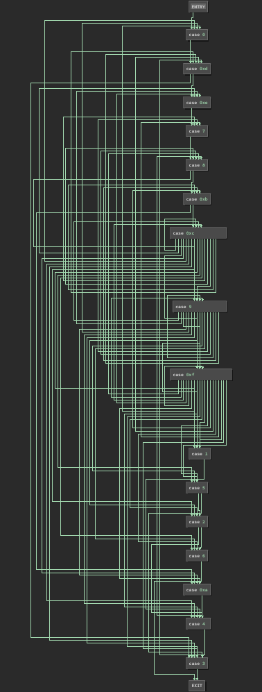

# Flatland

Using BinaryNinja to extract control flow.

## Challenge


## Solution




## Script

```py
#!/usr/bin/env python3

from binaryninja import *

bview = BinaryViewType.get_view_of_file('flatland')

key = bview.get_ascii_string_at(0x402150).value
maps = bview.define_user_data_var(0x402090, Type.array(Type.array(Type.int(0x4), 0x18), 0x2), 'maps').value

def solveFlag(known):
    if len(known) == 0x18:
        print(known)
        return
    if known[-1] == '}':
        return
    candidates = set()
    for m in maps:
        for pair in enumerate(m):
            for i in range(2):
                if pair[i] == key.index(known[-1]) and key[pair[1-i]] not in known:
                    candidates.add(key[pair[1-i]])
    for c in candidates:
        solveFlag(known + c)

solveFlag('actf{')
```

## Flag

```
actf{Fl4TmAn_rouNdw0R1D}
```
