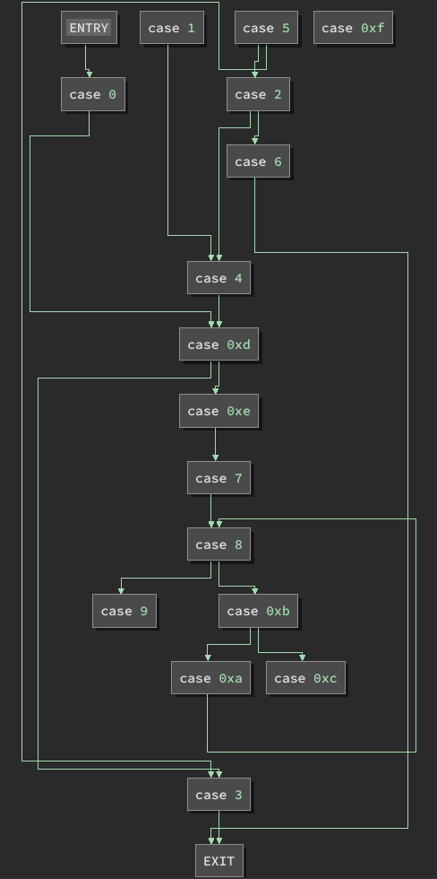

# Flatland


## Summary

- Use the Binary Ninja Python APIs to automate extracting to control flow of the program.
- Use the fixed CFG to reverse engineer the logic that validates a flag.
- Create a script to find the flag by checking possibly valid characters according to the validation logic.

*Also while I was doing this my teammates solved it with instruction counting...  but my method is cooler >:(*

## Challenge

We're given an x86-64 binary to reverse engineer.

The binary is a flag checker.
We can enter a guess and determine whether or not the guess is correct based on the response of the program.

### Behaviour

Running the binary will greet us with the following message, then wait for user input:

> I call our world Flatland, not because we call it so, but to make its nature clearer to you, my happy solvers, who are privileged to have control flow.

If we enter a random input, we are given the following response:

> All the substantial binaries of Flatland itself appear no better than the offspring of a diseased imagination, or the baseless instructions of a CPU.

### Pseudo C (Generated by Binary Ninja)

```c
00401140  int32_t main(int32_t argc, char** argv, char** envp) {

              // omitted some variable declarations

00401170      while (true) {
00401170          uint64_t rcx_1 = ((uint64_t)rax);
00401175          void var_64028;
00401175          void var_64020;
00401175          if (rax <= 0xf) {
00401177              switch (rcx_1) {
00401183                  case 0: {
00401183                      puts("I call our world Flatland, not b…");
0040118b                      int64_t rax_2 = (((int64_t)rbp) << 0xc);

                              // omitted code to set stack variables to zero

004011fd                      rbp = (rbp + 1);
00401200                      r15 = 1;
00401206                      rax = 0xd;
0040120b                      continue;
0040120b                  }

                          // omitted cases [0x1 -> 0xe]

0040125b                  case 0xf: {
0040125b                      rax = 3;
00401264                      if (rbx != -1) {
0040126d                          rax = *(int32_t*)(&var_64020 + (((int64_t)rbp) << 0xc));
00401269                      }
00401271                      rbp = (rbp - 1);
00401271                      break;
00401271                  }
00401271              }
00401271          }
00401175      }
004013e2      puts(rdi_1);
004013f6      return rbx_1;
004013f6  }
```

We can see that the body of the function is primarily a switch statement within a while loop.
Each case modifies RAX, which is used by the switch statement to determine which case to go to next.

From the start of the program, until the program exits, all code is contained within this while loop.
Program state is stored in a combination of registers and stack variables.
This greatly increases the difficulty of extracting the control flow of the program, as all branches are reachable from the same initial switch statement.

### Control Flow Graph (Generated by Binary Ninja)

As mentioned earlier, it is more difficult to recover the true control flow of the program due to the use of a central switch statement within the main loop.
The image below shows the CFG extracted by Binary Ninja (using Low Level IL).


As we can see, the central switch statement branches out to each of the 16 cases.
Most of these cases jump back to the beginning of the loop, which will reach the switch statement again and go to another block.

It would be very difficult, from this diagram alone, to determine how the program is checking a flag, as it appears that any node could lead to any other node.

## Solution

If we are able to recover the original control flow, we will have defeated a major source of the obfuscation and the program will be significantly easier to reverse engineer.

Before we begin, there are some important things to note about the program:

- All cases lead to the top of the loop or to the exit node.
- Any case which goes back to the top of the loop will set the RAX register beforehand.
- Some cases have branches within, which may result in a different RAX values.

### Extracting cases

The Binary Ninja Python API is very efficient at automating processes of this sort.
First, these are some useful handles we will be using to interact with Binary Ninja:

```py
# main function
main = bv.get_functions_by_name('main')[0]


# Mapped Medium Level IL SSA Form of the main function
ssa = main.mmlil.ssa_form
```

We are using Medium Level IL SSA Form as static single assignment will allow us to easily find the possible values of a variable.
This will be especially useful for determining which cases may be reached from a given block.
We are using Mapped mode so we can find the initial basic block of a case given a jump table destination, as the addresses of assembly instructions is mapped to the Medium Level IL lines in this mode.

To start reconstructing a control flow graph, we should first extract the individual cases that will act as the nodes of our graph.

```py
# dictionary containing a node and basic block for each case in the switch statement
cases = {}


# jump table used by the switch statement
jump_table = bv.get_data_var_at(0x402010).value


# graph used to display the reconstructed CFG
# entry_node and exit_note represent the entry and exit points of the program
graph = FlowGraph()

entry_node = FlowGraphNode(graph)
entry_node.lines = [f"ENTRY"]
graph.append(entry_node)

exit_node = FlowGraphNode(graph)
exit_node.lines = [f"EXIT"]
graph.append(exit_node)


# For each case in the switch statement:
# - Set the node
# - Set the initial basic block
for i in range(len(jump_table)):
    for block in ssa.basic_blocks:
        if block.start == ssa.get_instruction_start(jump_table[i]):
            node = FlowGraphNode(graph)
            graph.append(node)
            cases[i] = {
                    'block': block,
                    'node': node,
                    }
```

We may also want to display the code corresponding to these cases.
For the code displayed in each node, I chose High Level IL for two reasons:

- It is the most concise, so it will be easier to get a sense of how the program generally works from a CFG view.
- It is the easiest to parse cases from linear view, as the other views do not simplify branches within a case.

```py
# Add the case number and High Level IL instructions to each node
# This will be displayed on the graph
for x in main.hlil.instructions:
    if x.operation == HighLevelILOperation.HLIL_CASE:
        node = cases[x.operands[0][0].constant]['node']
        node.lines = list(x.lines)

        # whether or not to display HLIL code in a node
        if showInstructions:
            node.lines += ['='*16] + list(x.body.lines)
```

Now that we have mapped each case to its initial basic block and a node in our graph, we can parse these blocks to begin recovering control flow.

### Modeling control flow

We cannot simply check the end of the basic block for the value of RAX as some cases have subbranches.
To get all the possible next nodes for a case, we need to recursively analyze its blocks and get the possible values of RAX for each block that jumps back to the start of the loop.

The function below, `getPossibleRange(block)`, does exactly that.

```py
# All possible values for the next case number
# This should be a range of [0x0, 0xf]
possible_rcx = ssa[49].get_ssa_var_possible_values(ssa[49].vars_read[0]).ranges[0]


# Get the possible next nodes from a given block
def getPossibleRange(block):
    possible = set()

    # return an empty set if we reach the start of the loop
    if block.start == 13:
        return possible

    # return a set containing the exit_node if we reach the final block 
    if len(block.outgoing_edges) == 0:
        possible.add(exit_node)
        return possible

    # if the block has an immediate outgoing edge to the start of the loop
    # we need to check the possible values of RAX to determine the next node(s)
    if 13 in [edge.target.start for edge in block.outgoing_edges]:

        # iterate over the instructions in the block, starting at the bottom
        for i in range(block.end - 1, block.start - 1, -1):

            # get the last line (highest address) that modifies RAX
            if 'rax' in [x.name for x in ssa[i].vars_written]:
                possible_rax = ssa[i].get_ssa_var_possible_values(ssa[i].vars_written[0])

                # parse possible_rax to extract possible next nodes
                if hasattr(possible_rax, 'ranges'):
                    for rax_range in possible_rax.ranges:

                        # restrict the possible range to be within possible values of RCX
                        # i.e. only existing cases are possible next nodes
                        bounded_start = max(rax_range.start, possible_rcx.start)
                        bounded_end = min(rax_range.end, possible_rcx.end)
                        possible.update([cases[ii]['node'] for ii in range(bounded_start, bounded_end + 1, rax_range.step)])
                elif hasattr(possible_rax, 'values'):
                    possible.update([cases[ii]['node'] for ii in possible_rax.values])
                else:
                    possible.add(cases[possible_rax.value]['node'])

                break

    # recurse over outgoing edges and update the possible set
    for edge in block.outgoing_edges:
        possible.update(getPossibleRange(edge.target))

    # return the possble next nodes according to this block
    return possible
```

We will find that the graph produced by the code above is far too general to be of any use.
For now, let's hide the outgoing edges for cases where the next node can be any node.

```py
# in def getPossibleRange(block):

...

if hasattr(possible_rax, 'ranges'):
    for rax_range in possible_rax.ranges:
        bounded_start = max(rax_range.start, possible_rcx.start)
        bounded_end = min(rax_range.end, possible_rcx.end)

        # Exclude outgoing edges if the node is underconstrained
        if bounded_start <= 0 and bounded_end >= 0xf:
            continue

        possible.update([cases[ii]['node'] for ii in range(bounded_start, bounded_end + 1, rax_range.step)])

...
```

This will give us only edges which we can be reasonable certain are possible.
The resulting graph is an underapproximation of the actual control flow of the program, but can be used to determine a more accurate representation.


| Overapproximation | Underapproximation |
|-------------------|--------------------|
|  |  |

From either example, we can see that the underconstrained cases are `case 9`, `case 0xc`, and `case 0xf`.

```py
# in def getPossibleRange(block):
...

if 'rax' in [x.name for x in ssa[i].vars_written]:

    # If the next node is determined by r15, set the next node to 0xf
    if len(ssa[i].non_ssa_form.vars_read) == 1 and ssa[i].non_ssa_form.vars_read[0].name == 'r15':
        possible.add(cases[0xf]['node'])
        break

...
```


```py
# Manually add outgoing edges from case 0xf to cases 1, 3, 5
for i in [1, 3, 5]:
    cases[0xf]['node'].add_outgoing_edge(BranchType.UserDefinedBranch, cases[i]['node'])
```


### Understanding flag validation

### Extracting the flag

## Full Scripts

### Fix CFG

```py
def generateFixedCFG(showInstructions=True):
    main = bv.get_functions_by_name('main')[0]

    ssa = main.mmlil.ssa_form

    jump_table = bv.get_data_var_at(0x402010).value

    graph = FlowGraph()

    cases = {}

    possible_rcx = ssa[49].get_ssa_var_possible_values(ssa[49].vars_read[0]).ranges[0]

    entry_node = FlowGraphNode(graph)
    entry_node.lines = [f"ENTRY"]
    graph.append(entry_node)

    exit_node = FlowGraphNode(graph)
    exit_node.lines = [f"EXIT"]
    graph.append(exit_node)

    for i in range(len(jump_table)):
        for block in ssa.basic_blocks:
            if block.start == ssa.get_instruction_start(jump_table[i]):
                node = FlowGraphNode(graph)
                graph.append(node)
                cases[i] = {
                        'block': block,
                        'node': node,
                        }

    for x in main.hlil.instructions:
        if x.operation == HighLevelILOperation.HLIL_CASE:
            node = cases[x.operands[0][0].constant]['node']
            node.lines = list(x.lines)
            if showInstructions:
                node.lines += ['='*16] + list(x.body.lines)

    entry_node.add_outgoing_edge(BranchType.UserDefinedBranch, cases[0]['node'])

    def getPossibleRange(block):
        possible = set()
        if block.start == 13:
            return possible
        if len(block.outgoing_edges) == 0:
            possible.add(exit_node)
            return possible
        if 13 in [edge.target.start for edge in block.outgoing_edges]:
            for i in range(block.end - 1, block.start - 1, -1):
                if 'rax' in [x.name for x in ssa[i].vars_written]:
                    if len(ssa[i].non_ssa_form.vars_read) == 1 and ssa[i].non_ssa_form.vars_read[0].name == 'r15':
                        possible.add(cases[0xf]['node'])
                        break
                    possible_rax = ssa[i].get_ssa_var_possible_values(ssa[i].vars_written[0])
                    if hasattr(possible_rax, 'ranges'):
                        for rax_range in possible_rax.ranges:
                            bounded_start = max(rax_range.start, possible_rcx.start)
                            bounded_end = min(rax_range.end, possible_rcx.end)
                            if bounded_start <= 0 and bounded_end >= 0xf:
                                continue
                            possible.update([cases[ii]['node'] for ii in range(bounded_start, bounded_end + 1, rax_range.step)])
                    elif hasattr(possible_rax, 'values'):
                        possible.update([cases[ii]['node'] for ii in possible_rax.values])
                    else:
                        possible.add(cases[possible_rax.value]['node'])
                    break
        for edge in block.outgoing_edges:
            possible.update(getPossibleRange(edge.target))
        return possible

    for c in cases.values():
        if c['block'].immediate_post_dominator is None:
            c['node'].add_outgoing_edge(BranchType.UserDefinedBranch, exit_node)
            continue
        possible_branches = getPossibleRange(c['block'])
        for node in possible_branches:
            c['node'].add_outgoing_edge(BranchType.UserDefinedBranch, node)

    for i in [1, 3, 5]:
        cases[0xf]['node'].add_outgoing_edge(BranchType.UserDefinedBranch, cases[i]['node'])

    bv.show_graph_report("Fixed CFG", graph)
```

### Solve for flag

```py
#!/usr/bin/env python3

from binaryninja import *

bview = BinaryViewType.get_view_of_file('flatland')

key = bview.get_ascii_string_at(0x402150).value
maps = bview.define_user_data_var(0x402090, Type.array(Type.array(Type.int(0x4), 0x18), 0x2), 'maps').value

def solveFlag(known):
    if len(known) == 0x18:
        print(known)
        return
    elif known[-1] == '}':
        return
    candidates = set()
    for m in maps:
        for pair in enumerate(m):
            for i in range(2):
                if pair[i] == key.index(known[-1]) and key[pair[1-i]] not in known:
                    candidates.add(key[pair[1-i]])
    for c in candidates:
        solveFlag(known + c)

solveFlag('actf{')
```

## Flag

```
actf{Fl4TmAn_rouNdw0R1D}
```
