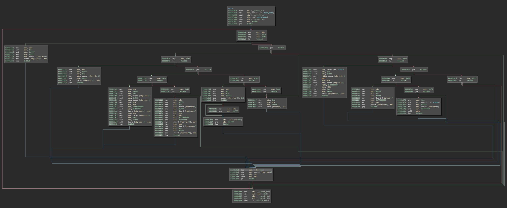

# self

## Challenge


The challenge is a binary executable that will print the flag when run.

However, running it as it is given require waiting an impractical amount of time.
Therefore, we must reverse engineer the program to find a way to speed up this process.

### High Level IL (Generated by Binary Ninja)

```c
int32_t main(int32_t argc, char** argv, char** envp)
    int32_t rdx = data_6038
    int32_t rbx = 0x800
    do
        uint32_t rax_3 = rdx u>> 0x18
        bool cond:0_1 = rax_3 u<= 0xd6
        if (rax_3 == 0xd6)
            *(&data_4038 + (zx.q(rdx u>> 0xc & 0xfff) << 2)) = *(&data_4038 + (zx.q(rdx & 0xfff) << 2))
        else if (cond:0_1)
            bool cond:1_1 = rax_3 u<= 0x18
            if (rax_3 == 0x18)
                uint64_t rax_29 = zx.q(rdx u>> 0xc & 0xfff)
                *(&data_4038 + (rax_29 << 2)) = *(&data_4038 + (rax_29 << 2)) ^ *(&data_4038 + (zx.q(rdx & 0xfff) << 2))
            else if (cond:1_1)
                if (rax_3 == 0x16)
                    uint64_t rax_16 = zx.q(rdx u>> 0xc & 0xfff)
                    int32_t rcx_4 = *(&data_4038 + (rax_16 << 2))
                    int32_t rcx_6 = (rcx_4 + *(&data_4038 + (zx.q(rdx & 0xfff) << 2))) & 0xffffff
                    *(&data_4038 + (rax_16 << 2)) = rcx_4 & 0xff000000
                    uint64_t rax_20 = zx.q(*(&data_4038 + (zx.q(rbx) << 2)) u>> 0xc & 0xfff)
                    *(&data_4038 + (rax_20 << 2)) = *(&data_4038 + (rax_20 << 2)) + rcx_6
                else
                    if (rax_3 != 0x17)
                        break
                    uint64_t rax_7 = zx.q(rdx u>> 0xc & 0xfff)
                    int32_t rcx_1 = *(&data_4038 + (rax_7 << 2))
                    int32_t rcx_3 = (rcx_1 - *(&data_4038 + (zx.q(rdx & 0xfff) << 2))) & 0xffffff
                    *(&data_4038 + (rax_7 << 2)) = rcx_1 & 0xff000000
                    uint64_t rax_11 = zx.q(*(&data_4038 + (zx.q(rbx) << 2)) u>> 0xc & 0xfff)
                    *(&data_4038 + (rax_11 << 2)) = *(&data_4038 + (rax_11 << 2)) + rcx_3
            else if (rax_3 == 0x69)
                int32_t rcx_7 = 1
                if (*(&data_4038 + (zx.q(rdx u>> 0xc & 0xfff) << 2)) == 0)
                    rcx_7 = rdx & 0xfff
                rbx = (rbx + rcx_7 - 1) & 0xfff
            else
                if (rax_3 != 0xa6)
                    break
                rbx = rdx u>> 0xc & 0xfff
        else
            bool cond:2_1 = rax_3 u<= 0xf7
            if (rax_3 == 0xf7)
                *(&data_4038 + (zx.q(*(&data_4038 + (zx.q(rbx) << 2)) u>> 0xc & 0xfff) << 2)) = getc(fp: stdin) | (*(&data_4038 + (zx.q(rdx u>> 0xc & 0xfff) << 2)) & 0xff000000)
            else
                if (not(cond:2_1) && rax_3 != 0xff)
                    break
                if (cond:2_1)
                    if (rax_3 == 0xd8)
                        uint64_t rcx_11 = zx.q(rdx u>> 0xc & 0xfff)
                        *(&data_4038 + (rcx_11 << 2)) = (rdx & 0xfff) | (*(&data_4038 + (rcx_11 << 2)) & 0xff000000)
                    else
                        if (rax_3 != 0xf6)
                            break
                        putc(c: *(&data_4038 + (zx.q(rdx u>> 0xc & 0xfff) << 2)) & 0xffffff, fp: stdout)
        uint64_t rax_1 = zx.q(rbx + 1)
        rdx = *(&data_4038 + (rax_1 << 2))
        rbx = rax_1.d
    while (rdx != 0)
    return 0
```

## Dissassembly CFG (Generated by Binary Ninja)



## Summary

- Figure out that the program is a virtual machine which runs bytecode stored in its data.
- Reverse engineer the virtual machine to learn how the operations behave.
- Disassemble the bytecode in the binary data.
- Reverse engineer the bytecode and patch out extra code.

## Solution

The first step is to figure out how the program works.

If we were to try running the program, we would get no response but the program would not terminate, regardless of what we tried sending.
If we watch the program in GDB, it seems to loop indefinitely within the `main()` function.

Let's look at the `main()` function to see if we can decipher what it's doing.

We can see that most of the logic is contained within a main loop, with only a couple variable definitions before the loop.
Also note that RBX is incremented with every iteration, and RDX is read from a value in data at an offset dependent on RBX.
We can also see that RDX is used at the start of each loop to define RAX, which is used as the condition for almost all of the branches.

```c
00001050  int32_t main(int32_t argc, char** argv, char** envp)
00001052      int32_t rdx = data_6038
00001061      int32_t rbx = 0x800
000010ac      do
000010b0          uint32_t rax_3 = rdx u>> 0x18

                  ...

000010a0          uint64_t rax_1 = zx.q(rbx + 1)
000010a3          rdx = *(&data_4038 + (rax_1 << 2))
000010a7          rbx = rax_1.d
000010a7      while (rdx != 0)
000010da      return 0
```

### Extracting types

Let's drop down to medium level IL to see if we can determine the types of these variables:

```c
000010a0  rax_1 = zx.q(rbx + 1)
000010a3  rdx = [data_4038 + (rax_1 << 2)].d
000010a7  rbx = rax_1.eax
000010ac  if (rdx == 0) then 23 @ 0x10d5 else 3 @ 0x10ae
```

We can see that RDX and RBX are both actually 4 bytes.
Also, `rax_1` is being multiplied by 4 to use as an offset from `data_4038` and read 4 bytes.
Thus, it is likely that `data_4038` is an array that stores elements of size 4.
Also, RDX is likely to be an unsigned integer as it it used in an unsigned right shift.
Using this information, let's set the type of these variables as `uint32_t`.

We can see that RBX initially points at `data_6038`, but is set relative to `data_4038` for the remainder of the program.
The bytes between 0x4038 and 0x6038 are null, while there is non-null data after 0x6038.
We have to consider whether we should treat these as two separate arrays or as one large array.
`data_6038` does start with data, and is the starting point for RDX, which implies it could be a separate array.
However, since everything is indexed from `data_4038`, I figured it would be easier if they were treated as a single array.

We also have to figure out where `data_4038` ends then.
From our brief look at the `main()` function, there doesn't appear to be an upper limit to RBX except what can be stored in 4 bytes.
There also aren't any references to data beyond what we've gone over.
Everything seems to be referenced relative to `data_4038`.
Therefore, let's set the size to occupy the entire data section after it, which gives it a size of 0xfff integers.
Let's also call it `data_arr` from here on.

This turns our `main()` function into something slightly more readable:

```c
00001050  int32_t main(int32_t argc, char** argv, char** envp)
00001052      uint32_t rdx = data_arr[0x800]
00001061      uint32_t rbx = 0x800
000010ac      do
000010b0          uint32_t rax_3 = rdx u>> 0x18

                  ...

000010a3          rdx = data_arr[rbx + 1]
000010a7          rbx = rbx + 1
000010a0      while (rdx != 0)
000010da      return 0
```

### Understanding the branches

There appears to be a number of nested branches which check RAX.

```c
000010b8          if (rax_3 == 0xd6)
000011fc              data_arr[zx.q(rdx u>> 0xc & 0xfff)] = data_arr[zx.q(rdx & 0xfff)]
000010be          else if (cond:0_1)
00001070              bool cond:1_1 = rax_3 u<= 0x18
00001073              if (rax_3 == 0x18)
00001241                  uint64_t rax_29 = zx.q(rdx u>> 0xc & 0xfff)
00001246                  data_arr[rax_29] = data_arr[rax_29] ^ data_arr[zx.q(rdx & 0xfff)]
00001079              else if (cond:1_1)
0000111b                  if (rax_3 == 0x16)
000011b4                      uint64_t rax_16 = zx.q(rdx u>> 0xc & 0xfff)
000011b9                      int32_t rcx_4 = data_arr[rax_16]
000011c7                      int32_t rcx_6 = (rcx_4 + data_arr[zx.q(rdx & 0xfff)]) & 0xffffff
000011cd                      data_arr[rax_16] = rcx_4 & 0xff000000
000011da                      uint64_t rax_20 = zx.q(data_arr[zx.q(rbx)] u>> 0xc & 0xfff)
000011df                      data_arr[rax_20] = data_arr[rax_20] + rcx_6
00001124                  else
00001124                      if (rax_3 != 0x17)
00001124                          break
00001135                      uint64_t rax_7 = zx.q(rdx u>> 0xc & 0xfff)
0000113a                      int32_t rcx_1 = data_arr[rax_7]
00001148                      int32_t rcx_3 = (rcx_1 - data_arr[zx.q(rdx & 0xfff)]) & 0xffffff
0000114e                      data_arr[rax_7] = rcx_1 & 0xff000000
0000115b                      uint64_t rax_11 = zx.q(data_arr[zx.q(rbx)] u>> 0xc & 0xfff)
00001160                      data_arr[rax_11] = data_arr[rax_11] + rcx_3
00001082              else if (rax_3 == 0x69)
00001207                  int32_t rcx_7 = 1
00001219                  if (data_arr[zx.q(rdx u>> 0xc & 0xfff)] == 0)
0000121d                      rcx_7 = rdx & 0xfff
00001227                  rbx = (rbx + rcx_7 - 1) & 0xfff
0000108d              else
0000108d                  if (rax_3 != 0xa6)
0000108d                      break
00001094                  rbx = rdx u>> 0xc & 0xfff
000010c0          else
000010c0              bool cond:2_1 = rax_3 u<= 0xf7
000010c5              if (rax_3 == 0xf7)
0000119c                  data_arr[zx.q(data_arr[zx.q(rbx)] u>> 0xc & 0xfff)] = getc(fp: stdin) | (data_arr[zx.q(rdx u>> 0xc & 0xfff)] & 0xff000000)
000010d2              else
000010d2                  if (not(cond:2_1) && rax_3 != 0xff)
000010d2                      break
000010cb                  if (cond:2_1)
000010e5                      if (rax_3 == 0xd8)
0000125a                          uint64_t rcx_11 = zx.q(rdx u>> 0xc & 0xfff)
0000126b                          data_arr[rcx_11] = (rdx & 0xfff) | (data_arr[rcx_11] & 0xff000000)
000010f0                      else
000010f0                          if (rax_3 != 0xf6)
000010f0                              break
0000110c                          putc(c: data_arr[zx.q(rdx u>> 0xc & 0xfff)] & 0xffffff, fp: stdout)
```

However, upon closer inspection, we can see that the inequalities can be ignored, as this is actually just a switch statement.

We can rewrite the above code as follows:

```c
switch (rax_3)
    case 0x16:
        uint64_t rax_16 = zx.q(rdx u>> 0xc & 0xfff)
        int32_t rcx_4 = data_arr[rax_16]
        int32_t rcx_6 = (rcx_4 + data_arr[zx.q(rdx & 0xfff)]) & 0xffffff
        data_arr[rax_16] = rcx_4 & 0xff000000
        uint64_t rax_20 = zx.q(data_arr[zx.q(rbx)] u>> 0xc & 0xfff)
        data_arr[rax_20] = data_arr[rax_20] + rcx_6
        break
    case 0x17:
        uint64_t rax_7 = zx.q(rdx u>> 0xc & 0xfff)
        int32_t rcx_1 = data_arr[rax_7]
        int32_t rcx_3 = (rcx_1 - data_arr[zx.q(rdx & 0xfff)]) & 0xffffff
        data_arr[rax_7] = rcx_1 & 0xff000000
        uint64_t rax_11 = zx.q(data_arr[zx.q(rbx)] u>> 0xc & 0xfff)
        data_arr[rax_11] = data_arr[rax_11] + rcx_3
        break
    case 0x18:
        uint64_t rax_29 = zx.q(rdx u>> 0xc & 0xfff)
        data_arr[rax_29] = data_arr[rax_29] ^ data_arr[zx.q(rdx & 0xfff)]
        break
    case 0x69:
        int32_t rcx_7 = 1
        if (data_arr[zx.q(rdx u>> 0xc & 0xfff)] == 0)
            rcx_7 = rdx & 0xfff
        rbx = (rbx + rcx_7 - 1) & 0xfff
        break
    case 0xa6:
        rbx = rdx u>> 0xc & 0xfff
    case 0xd6:
        data_arr[zx.q(rdx u>> 0xc & 0xfff)] = data_arr[zx.q(rdx & 0xfff)]
        break
    case 0xd8:
        uint64_t rcx_11 = zx.q(rdx u>> 0xc & 0xfff)
        data_arr[rcx_11] = (rdx & 0xfff) | (data_arr[rcx_11] & 0xff000000)
        break
    case 0xf6:
        putc(c: data_arr[zx.q(rdx u>> 0xc & 0xfff)] & 0xffffff, fp: stdout)
        break
    case 0xf7:
        data_arr[zx.q(data_arr[zx.q(rbx)] u>> 0xc & 0xfff)] = getc(fp: stdin) | (data_arr[zx.q(rdx u>> 0xc & 0xfff)] & 0xff000000)
    case 0xff:
        break
    default:
        break
```

Now we can begin to decipher the logic for each case.
Recall that RAX is defined by `uint32_t rax_3 = rdx u>> 0x18`, so we already know the first byte for each case as it is the condition of that case.

Let's start with `case 0x16`.
It takes the 17th to 40th most significant bits as an index for data, lets call this the first index.
It also uses the 41st to 64th most significant bits as another index.
We then take the sum of the elements at these indices and apply a bitmask to get only the least significant 3 bytes.
The result is stored back in the array at the first index, with the most significant byte unchanged.

Looking at the next cases, `case 0x17` and `case 0x18` do the same, except with subtraction and xor, respectively.
The xor operation is slightly different as it modifies the entire integer, while addition and subtraction do not modify the most significant byte.

From what we have checked so far, we can see that the operation is determined by the most significant byte of an integer.
We can also see that the operands are determined by the remaining 3 bytes, split evenly between 2 operands.
Recall that, at the end of each loop, the index is incremented and we read the next integer into this switch statement.
This all suggests that the program is a virtual machine, with `data_arr` stores the program memory including bytecode.

### Extracting instruction definitions

We can see that all the instructions follow the same structure:

```
AA BBB CCC
```

where each character represents a hexadecimal digit.
From here on, let instructions be represented by the following tokens:

```
opcode arg1 arg2
```

Also, let PC be the program counter, which is also the current value of RBX.

One change we are going to make for clarity is to resolve relative branches to be absolute, so that both jumps and branches can be read the same.

Now, going through all the cases as we did with `case 0x16`, we get the following definitions:

| opcode | mnemonic | long name | notes |
|-|-|-|-|
| 0x00 | `halt` | halt | end of program execution
| 0x16 | `add [arg1] [arg2]` | addition | adds `data_arr[arg1]` and `data_arr[arg2]` and stores the result in `data_arr[arg1]`; preserves the most significant byte of the destination
| 0x17 | `sub [arg1] [arg2]` | subtraction | subtracts `data_arr[arg1]` and `data_arr[arg2]` and stores the result in `data_arr[arg1]`; preserves the most significant byte of the destination
| 0x18 | `xor [arg1] [arg2]` | exclusive-or | xors `data_arr[arg1]` and `data_arr[arg2]` and stores the result in `data_arr[arg1]`
| 0x69 | `brz [arg1] PC+arg2` | branch if zero | changes PC by arg2 if `data_arr[arg1]` is zero
| 0xa6 | `jmp arg1` | jump | changes PC to `arg1`
| 0xd6 | `mov [arg1] [arg2]` | move from memory | copies all 4 bytes from `data_arr[arg2]` to `data_arr[arg1]`
| 0xd8 | `mov [arg1] arg2` | move absolute value | sets the least significant 20 bits of `data_arr[arg1]`; preserves the most significant byte of the destination; other bits are zeroed
| 0xf6 | `put [arg1]` | putc | prints the character at the least significant byte of `data_arr[arg1]`
| 0xf7 | `get [arg1]` | getc | reads a character into the least significant byte of `data_arr[arg1]`; preserves the most significant byte of the destination; other bits are zeroed
| 0xff | `nop` | no operation | while 0xff is the only dedicated nop instruction, all opcodes not included in this table also function as a nop

### Disassembling bytecode

We can now use the Binary Ninja API to extract and disassemble the bytecode.
Also, we can add cross references for jumps and branches to help reverse this code.

Using a Python script, which can be found near the end of this writeup, we get the following assembly (after manually adding some newlines for clarity):

```asm
0x800 d8000000 mov [0x0], 0x0
0x801 d8001001 mov [0x1], 0x1
0x802 d80031ff mov [0x3], 0x1ff
0x803 d8010000 mov [0x10], 0x0
0x804 d8011000 mov [0x11], 0x0
0x805 d8012000 mov [0x12], 0x0
0x806 d8013000 mov [0x13], 0x0
0x807 d8014000 mov [0x14], 0x0
0x808 d8015000 mov [0x15], 0x0
0x809 d8016000 mov [0x16], 0x0
0x80a d8017000 mov [0x17], 0x0
0x80b d8018000 mov [0x18], 0x0
0x80c d8019000 mov [0x19], 0x0
0x80d d801a000 mov [0x1a], 0x0
0x80e d801b000 mov [0x1b], 0x0
0x80f d801c000 mov [0x1c], 0x0
0x810 d801d000 mov [0x1d], 0x0
0x811 d801e000 mov [0x1e], 0x0
0x812 d801f000 mov [0x1f], 0x0

0x813 d801afff mov [0x1a], 0xfff
0x814 6901a054 brz [0x1a], 0x868                XREFS: ['0x867']
0x815 1701a001 sub [0x1a], [0x1]

0x816 d8019fff mov [0x19], 0xfff
0x817 69019050 brz [0x19], 0x867                XREFS: ['0x866']
0x818 17019001 sub [0x19], [0x1]

0x819 d8018fff mov [0x18], 0xfff
0x81a 6901804c brz [0x18], 0x866                XREFS: ['0x865']
0x81b 17018001 sub [0x18], [0x1]

0x81c d8017fff mov [0x17], 0xfff
0x81d 69017048 brz [0x17], 0x865                XREFS: ['0x864']
0x81e 17017001 sub [0x17], [0x1]

0x81f d801f074 mov [0x1f], 0x74
0x820 d801e8dd mov [0x1e], 0x8dd
0x821 d801d950 mov [0x1d], 0x950
0x822 d801c010 mov [0x1c], 0x10
0x823 d801b001 mov [0x1b], 0x1
0x824 d601001c mov [0x10], [0x1c]


0x825 6901c004 brz [0x1c], 0x829                XREFS: ['0x828']
0x826 1701c001 sub [0x1c], [0x1]
0x827 1601101e add [0x11], [0x1e]
0x828 69000ffd brz [0x0], 0x825

0x829 d601e011 mov [0x1e], [0x11]              XREFS: ['0x825']
0x82a d6011000 mov [0x11], [0x0]
0x82b d601c010 mov [0x1c], [0x10]
0x82c d6010000 mov [0x10], [0x0]
0x82d d601001c mov [0x10], [0x1c]


0x82e 6901c004 brz [0x1c], 0x832                XREFS: ['0x831']
0x82f 1701c001 sub [0x1c], [0x1]
0x830 1601101e add [0x11], [0x1e]
0x831 69000ffd brz [0x0], 0x82e

0x832 d601e011 mov [0x1e], [0x11]              XREFS: ['0x82e']
0x833 d6011000 mov [0x11], [0x0]
0x834 d601c010 mov [0x1c], [0x10]
0x835 d6010000 mov [0x10], [0x0]
0x836 d601001c mov [0x10], [0x1c]


0x837 6901c004 brz [0x1c], 0x83b                XREFS: ['0x83a']
0x838 1701c001 sub [0x1c], [0x1]
0x839 1601101e add [0x11], [0x1e]
0x83a 69000ffd brz [0x0], 0x837

0x83b d601e011 mov [0x1e], [0x11]              XREFS: ['0x837']
0x83c d6011000 mov [0x11], [0x0]
0x83d d601c010 mov [0x1c], [0x10]
0x83e d6010000 mov [0x10], [0x0]
0x83f d601001c mov [0x10], [0x1c]


0x840 6901c004 brz [0x1c], 0x844                XREFS: ['0x843']
0x841 1701c001 sub [0x1c], [0x1]
0x842 1601101b add [0x11], [0x1b]
0x843 69000ffd brz [0x0], 0x840

0x844 d601b011 mov [0x1b], [0x11]              XREFS: ['0x840']
0x845 d6011000 mov [0x11], [0x0]
0x846 d601c010 mov [0x1c], [0x10]
0x847 d6010000 mov [0x10], [0x0]
0x848 d601001c mov [0x10], [0x1c]


0x849 6901c004 brz [0x1c], 0x84d                XREFS: ['0x84c']
0x84a 1701c001 sub [0x1c], [0x1]
0x84b 1601101b add [0x11], [0x1b]
0x84c 69000ffd brz [0x0], 0x849

0x84d d601b011 mov [0x1b], [0x11]              XREFS: ['0x849']
0x84e d6011000 mov [0x11], [0x0]
0x84f d601c010 mov [0x1c], [0x10]
0x850 d6010000 mov [0x10], [0x0]
0x851 d601001c mov [0x10], [0x1c]


0x852 6901c004 brz [0x1c], 0x856                XREFS: ['0x855']
0x853 1701c001 sub [0x1c], [0x1]
0x854 1601101b add [0x11], [0x1b]
0x855 69000ffd brz [0x0], 0x852

0x856 d601b011 mov [0x1b], [0x11]              XREFS: ['0x852']
0x857 d6011000 mov [0x11], [0x0]
0x858 d601c010 mov [0x1c], [0x10]
0x859 d6010000 mov [0x10], [0x0]


0x85a 6901f00a brz [0x1f], 0x864                XREFS: ['0x863']
0x85b 1701f001 sub [0x1f], [0x1]
0x85c 1701e01b sub [0x1e], [0x1b]
0x85d 1701d001 sub [0x1d], [0x1]
0x85e 1686001e add [0x860], [0x1e]
0x85f 1686001d add [0x860], [0x1d]
0x860 18000000 xor [0x0], [0x0]
0x861 1786001e sub [0x860], [0x1e]
0x862 1786001d sub [0x860], [0x1d]

0x863 a6859000 jmp 0x85a
0x864 a681c000 jmp 0x81d                       XREFS: ['0x85a']
0x865 a6819000 jmp 0x81a                       XREFS: ['0x81d']
0x866 a6816000 jmp 0x817                       XREFS: ['0x81a']
0x867 a6813000 jmp 0x814                       XREFS: ['0x817']

0x868 ffffffff nop                             XREFS: ['0x814']
```

The code before this section is of course all halts, while the code after is not sensible assembly, so it has been omitted here.

As we can see, there are a number of outer loops which run 0xfff times, and some smaller inner loops.
These outer loops are likely to be the cause of the problem, as it would take `0xfff ** 4` iterations of the inner most of these larger loops for the program to finish.

Note that, on lines 0x85e, 0x85f, 0x861, and 0x862, the bytecode is self-modifying.
In particular, these four tines all modify the instruction on 0x860, which is `xor [0x0], [0x0]` by default.
We can see that these instructions actually modify the arguments of the xor instruction, with the first two lines setting up arguments, and the second two lines clearing them to prepare for the next iteration.

### Converting bytecode to Python

Let's turn this assembly into something more readable.
Python is great for this because it's basically English.
It also lets us make changes easily which helps with simplifying the program.

Some variable declarations are omitted from the start of these code snippets:

```py
data[0x1a] = 0xfff
while data[0x1a] != 0:
    data[0x1a] -= 1

    data[0x19] = 0xfff
    while data[0x19] != 0:
        data[0x19] -= 1

        data[0x18] = 0xfff
        while data[0x18] != 0:
            data[0x18] -= 1

            data[0x17] = 0xfff
            while data[0x17] != 0:
                data[0x17] -= 1

                data[0x1f] = 0x74
                data[0x1e] = 0x8dd
                data[0x1d] = 0x950
                data[0x1c] = 0x10
                data[0x1b] = 0x1
                data[0x10] = 0x10

                while data[0x1c] != 0:
                    data[0x1c] -= 1
                    data[0x11] += 0x8dd

                data[0x1e] = data[0x11]
                data[0x11] = 0
                data[0x1c] = 0x10
                data[0x10] = 0x10

                while data[0x1c] != 0:
                    data[0x1c] -= 1
                    data[0x11] += data[0x1e]

                data[0x1e] = data[0x11]
                data[0x11] = 0
                data[0x1c] = 0x10
                data[0x10] = 0x10

                while data[0x1c] != 0:
                    data[0x1c] -= 1
                    data[0x11] += data[0x1e]

                data[0x1e] = data[0x11]
                data[0x11] = 0
                data[0x1c] = 0x10
                data[0x10] = 0x10

                while data[0x1c] != 0:
                    data[0x1c] -= 1
                    data[0x11] += data[0x1b]

                data[0x1b] = data[0x11]
                data[0x11] = 0
                data[0x1c] = 0x10
                data[0x10] = 0x10

                while data[0x1c] != 0:
                    data[0x1c] -= 1
                    data[0x11] += data[0x1b]

                data[0x1b] = data[0x11]
                data[0x11] = 0
                data[0x1c] = 0x10
                data[0x10] = 0x10

                while data[0x1c] != 0:
                    data[0x1c] -= 1
                    data[0x11] += data[0x1b]

                data[0x1b] = data[0x11]
                data[0x11] = 0
                data[0x1c] = 0x10
                data[0x10] = 0x10

                while data[0x1f] != 0:
                    data[0x1f] -= 1
                    data[0x1e] -= data[0x1b]
                    data[0x1d] -= 1
                    data[0x860] += data[0x1e]
                    data[0x860] += data[0x1d]
                    data[(data[0x1e] + data[0x1d]) >> 0xc] ^= data[(data[0x1e] + data[0x1d]) & 0xfff]
                    data[0x860] -= data[0x1e]
                    data[0x860] -= data[0x1d]
```

If we look at the smaller inner loops, we can see that they're simply setting up constant variables.
We find that these constants are the same for any iteration of the loop.
We can actually factor these out completely, which gives us the following code:

```py
data[0x1a] = 0xfff
while data[0x1a] != 0:
    data[0x1a] -= 1

    data[0x19] = 0xfff
    while data[0x19] != 0:
        data[0x19] -= 1

        data[0x18] = 0xfff
        while data[0x18] != 0:
            data[0x18] -= 1

            data[0x17] = 0xfff
            while data[0x17] != 0:
                data[0x17] -= 1

                data[0x1f] = 0x74
                data[0x1e] = 0x8dd
                data[0x1d] = 0x950
                data[0x1b] = 0x1
                data[0x10] = 0x10

                data[0x11] += 0x8dd0

                data[0x11] *= 0x100

                data[0x1e] = data[0x11]

                data[0x11] = 0x10

                data[0x11] *= 0x100

                data[0x1b] = data[0x11]

                data[0x11] = 0
                data[0x1c] = 0x10
                data[0x10] = 0x10

                while data[0x1f] != 0:
                    data[0x1f] -= 1
                    data[0x1e] -= data[0x1b]
                    data[0x1d] -= 1
                    print(hex(data[0x1e]), hex(data[0x1d]))
                    print(hex((data[0x1e] + data[0x1d]) >> 0xc), hex(data[(data[0x1e] + data[0x1d]) >> 0xc]))
                    print()
                    data[(data[0x1e] + data[0x1d]) >> 0xc] ^= data[(data[0x1e] + data[0x1d]) & 0xfff]
```

Now we can see that the inner-most loop is simply xoring data after it with some constant values.
Note that the second argument to xor is unchanged, and the first argument is always the result of the previous.
Since `A ^ B ^ B = A`, and we are xoring an odd number of times, all this code does the equivalent of xoring the specified area once.
Therefore, we can factor out the outer loops to get the following simplified code:

```py
data[0x1f] = 0x74
data[0x1e] = 0x8dd000
data[0x1d] = 0x950

while data[0x1f] != 0:
    data[0x1f] -= 1

    data[0x1e] -= 0x1000
    data[0x1d] -= 1
    data[(data[0x1e] + data[0x1d]) >> 0xc] ^= data[(data[0x1e] + data[0x1d]) & 0xfff]
    print(hex(data[0x1e]), hex(data[0x1d]))
    print(hex((data[0x1e] + data[0x1d]) >> 0xc), hex(data[(data[0x1e] + data[0x1d]) >> 0xc]))
    print()
```

Running this gives is more assembly code after the nop at the end of what we already analyzed.
We could disassemble this and reverse it by repeating the above steps.
However, there are no more large loops, and there is a `putc()` call that does not require user input.
Instead, let's try to run the program with this new code.

### Patching

To bypass the loops, one option is to change every loop to have a limit of 1 iteration, so we only perform the first xor and skip the extra ones which only serve to waste time.
Alternatively, we could perform the xor ourselves and include the result in the patch, then jump past all the loops directly to the second stage.
I went with the later method, but both are fine.

```py
from data_arr import data

data[0x1f] = 0x74
data[0x1e] = 0x8dd000
data[0x1d] = 0x950

while data[0x1f] != 0:
    data[0x1f] -= 1
    data[0x1e] -= 0x1000
    data[0x1d] -= 1
    data[(data[0x1e] + data[0x1d]) >> 0xc] ^= data[(data[0x1e] + data[0x1d]) & 0xfff]

from pwn import p32

raw = b''

for i in range(len(data)):
    if i == 0x800:
        raw += p32(0xa6869000)
        continue
    if i > 0x8db:
        break
    raw += p32(data[i])

print(raw)
```

The first half of the patch script is taken from our simplified Python version of the disassembled bytecode, which performs the xor.
In the second part, we replace the instruction at 0x800 with a jump to the second stage, skipping the first stage loops.
This script will print the raw bytes of the patch for us.

To apply this patch, we can run the script in Binary Ninja, followed by this line:

```py
bv.get_data_var_at(0x403c).value = raw
```

This will replace the entire array with our patched code.

If we now run the patched program, it immediately prints the flag.

## Scripts

### Disassemble bytecode

<details>

<summary>show script</summary>

```py
#!/usr/bin/env python3

from binaryninja import *

bview = BinaryViewType.get_view_of_file('chall')
bview.get_data_var_at(0x4038).type = bview.parse_type_string('uint32_t[0x1000]')[0]

mem = bview.get_data_var_at(0x4038).value

disasm = {}

def process_ins(ins, offset):
    op = ins >> 0x18
    arg1 = (ins >> 0xc) & 0xfff
    arg2 = ins & 0xfff
    text = None
    target = None
    match op:
        case 0x00:
            text = 'halt'
        case 0xd6:
            text = f'mov [{hex(arg1)}], [{hex(arg2)}]'
        case 0xd8:
            text = f'mov [{hex(arg1)}], {hex(arg2)}'
        case 0x16:
            text = f'add [{hex(arg1)}], [{hex(arg2)}]'
        case 0x17:
            text = f'sub [{hex(arg1)}], [{hex(arg2)}]'
        case 0x18:
            text = f'xor [{hex(arg1)}], [{hex(arg2)}]'
        case 0x69:
            target = arg2
            if target > 0x7ff:
                target -= 0x1000
            target += offset
            text = f'brz [{hex(arg1)}], {hex(target)}'
        case 0xa6:
            target = arg1 + 1
            text = f'jmp {hex(target)}'
        case 0xf6:
            text = f'put [{hex(arg1)}]'
        case 0xf7:
            text = f'get {hex(arg1)}'
        case _:
            text = 'nop'

    if target:
        if target not in disasm:
            disasm[target] = {}
            disasm[target]['text'] = ''
            disasm[target]['xref'] = []
        disasm[target]['xref'].append(offset)
    if text:
        if offset not in disasm:
            disasm[offset] = {}
            disasm[offset]['text'] = ''
            disasm[offset]['xref'] = []
        disasm[offset]['text'] = text

for i in range(len(mem)):
    process_ins(mem[i], i)

disasm = dict(sorted(disasm.items()))

for i in disasm:
    addr = 0x4038 + (i * 4)
    fulltext = disasm[i]['text']
    if len(disasm[i]['xref']) > 0:
        fulltext = fulltext.ljust(0x20, ' ') + 'XREFS: ' + str([hex(x) for x in disasm[i]['xref']])
    print(hex(i), f'{mem[i]:x}', fulltext)
    bview.set_comment_at(addr, fulltext)
```

</details>

### Patch binary

<details>

<summary>show script</summary>

```py
#!/usr/bin/env python3

from binaryninja import *

bview = BinaryViewType.get_view_of_file('chall')
bview.get_data_var_at(0x4038).type = bview.parse_type_string('uint32_t[0x1000]')[0]

data = bview.get_data_var_at(0x4038).value

data[0x1f] = 0x74
data[0x1e] = 0x8dd000
data[0x1d] = 0x950

while data[0x1f] != 0:
    data[0x1f] -= 1
    data[0x1e] -= 0x1000
    data[0x1d] -= 1
    data[(data[0x1e] + data[0x1d]) >> 0xc] ^= data[(data[0x1e] + data[0x1d]) & 0xfff]

from pwn import p32

raw = b''

for i in range(len(data)):
    if i == 0x800:
        raw += p32(0xa6869000)
        continue
    if i > 0x8db:
        break
    raw += p32(data[i])

print(raw)

# patch in binary ninja:
'''
bv.get_data_var_at(0x403c).value = raw
'''
```

</details>

## Flag

```
actf{the_flag_was_you_all_along}
```
