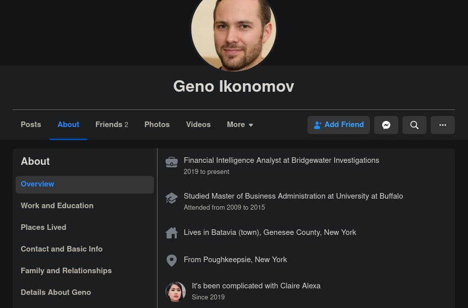
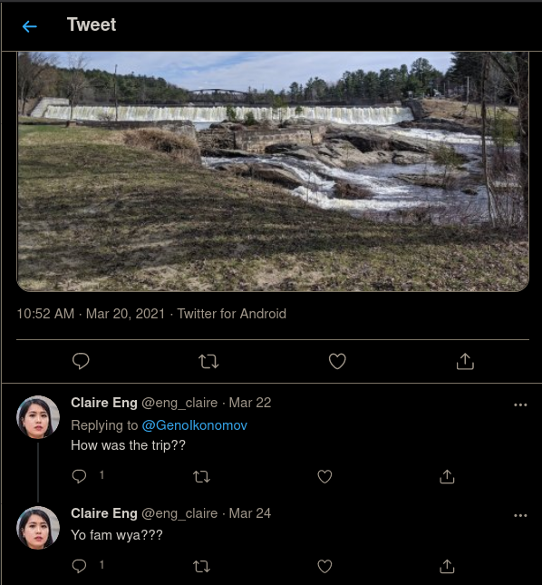
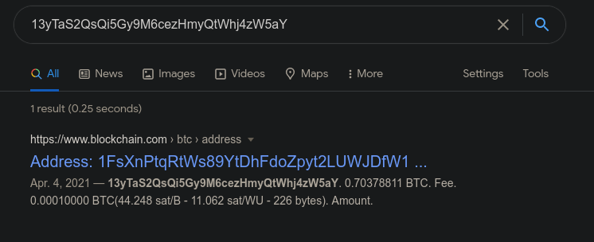
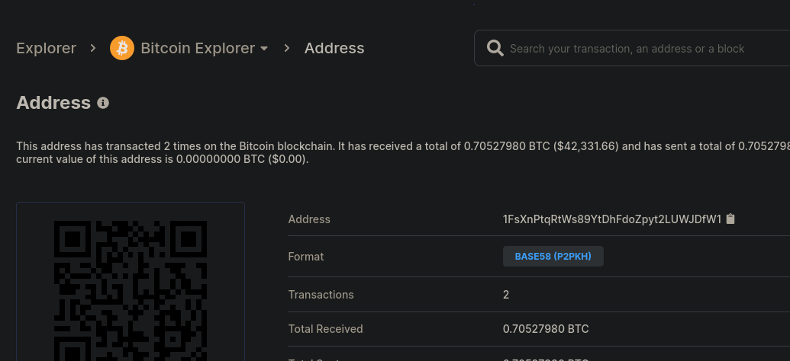
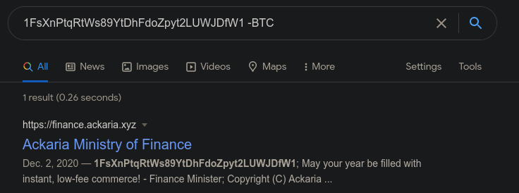
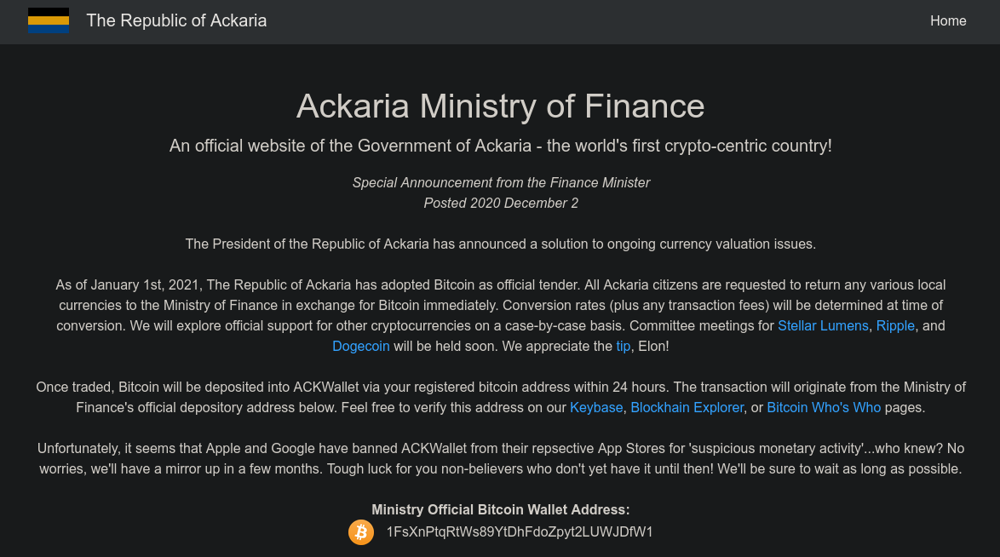
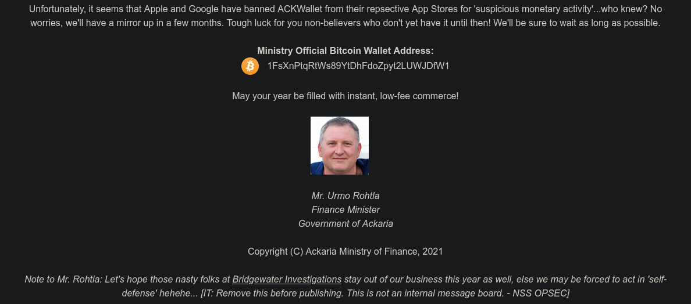

# APT Interference

Please DO NOT attempt to reset the password for any accounts or social engineer the characters. We have taken action to prevent this in the future and your activity will likely be flagged as malicious by the account providers.

Please DO NOT like, follow, connect with, or contact any characters on any platforms. You will not get a response and it will not help you solve the challenge.

Geno’s ex is speculated to be involved in his disappearance. Try to find some incriminating information on her social media. What nation-state is she working with? (Wrap the answer in RS{})

Author: t0uc4n

## Solution

From Geno's Linkedin page in the challenge "Finding Geno", we can see that he has linked about.me page with his social media info:

From here, we can find Geno's Facebook profile to view his relationship status:

We can see that the ex mentioned in the challenge description is Claire Alexa.
While we can't find anything directly from her Facebook, we can now search for her other social media accounts.

Using the same about.com page from earlier, let's look at Geno's Twitter profile:

We can see that Claire Alexa has commented on one of his recent posts.
If we now follow this to her Twitter profile, we can see a bitcoin address in her bio.
Googling this address or using a blockchain explorer shows that she is involved in transactions with another wallet:

If we now google this wallet address, we find a link to the website of the Ackaria Ministry of Finance:

Following this link, we can see that this wallet is the official BTC wallet for the ministry:

Near the bottom of this same page, we can see a note that was mistakenly included:

With this information, we can be pretty confident that the nation-state the challenge refers to is Ackaria.

## Flag

`RS{Ackaria}`

