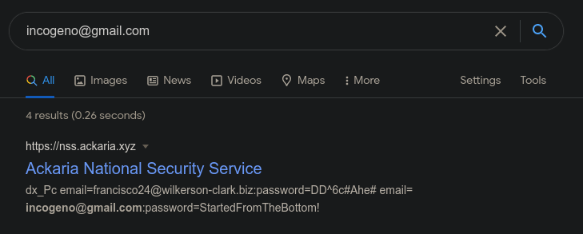

# Data Breach

Please DO NOT subscribe Geno's email to data breach identification services! This includes AVAST HACK CHECK, AUTHLOGICS, HAVE I BEEN PWNED, SCATTERED SECRETS, INTELLIGENCE X, FIREFOX MONITOR, etc. These will not help you solve the challenge.

Please DO NOT attempt to reset the password for any accounts or social engineer the characters. We have taken action to prevent this in the future and your activity will likely be flagged as malicious by the account providers.

Please DO NOT like, follow, connect with, or contact any characters on any platforms. You will not get a response and it will not help you solve the challenge.

Oh no! Geno’s email was involved in a data breach! What was his password? Author: t0uc4n

## Solution

From Geno's Linkedin page in the previous challenge, we can see that his email address is `incogeno@gmail.com`.

Searching for this email in google gives us the following leak:

We can see his password included in the preview: `StartedFromTheBottom!`.

## Flag

`RS{StartedFromTheBottom!}`

