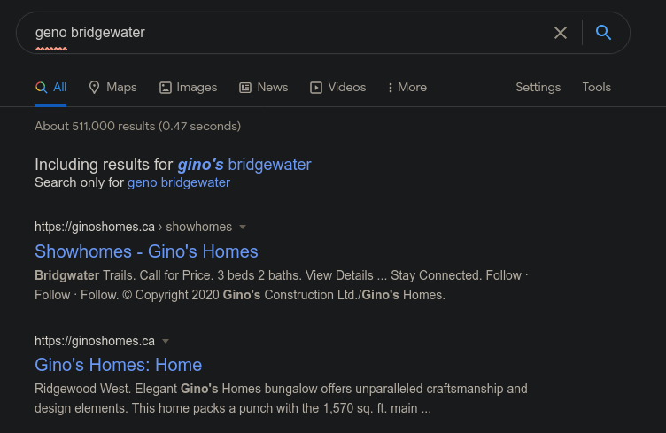
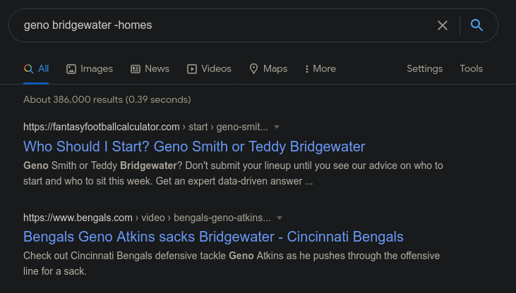
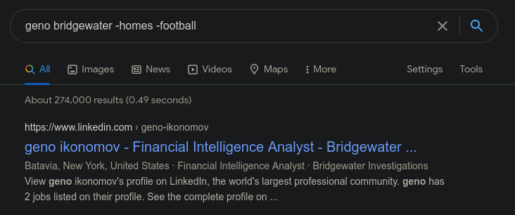
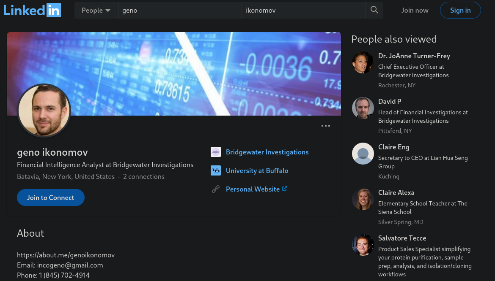

# Finding Geno

Disclaimer:
This challenge was first solved by a team mate from Maple Bacon, then solve again independently by me as it includes information needed for the next parts of this challenge.
I'm including this writeup as a set up for these next challenges.

Please DO NOT attempt to reset the password for any accounts or social engineer the characters. We have taken action to prevent this in the future and your activity will likely be flagged as malicious by the account providers.

Please DO NOT like, follow, connect with, or contact any characters on any platforms. You will not get a response and it will not help you solve the challenge.

We know that our missing person’s name is Geno and that he works for a local firm called Bridgewater. What is his last name? (Wrap the answer in RS{})

Author: t0uc4n

## Solution

We start by googling `geno bridgewater`:

As we can see, there are a number of irrelevant results.
We can filter the first of these by removing results that include `homes`:

Again, there are irrelevant results.
These can also be removed by filtering out `football` related results:

We find his LinkedIn which includes his full name:

## Flag

`RS{Ikonomov}`

