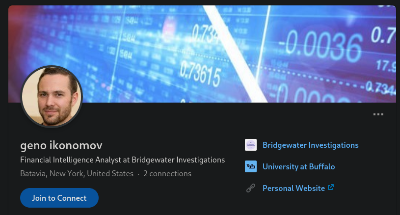
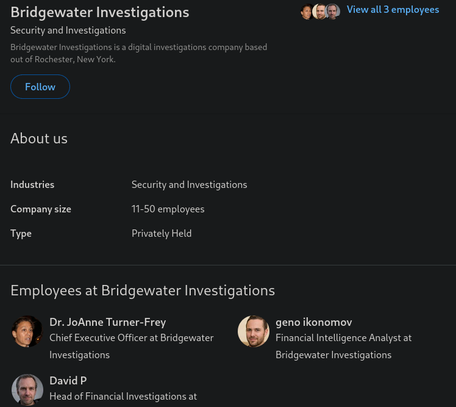
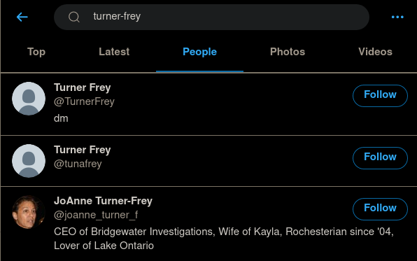
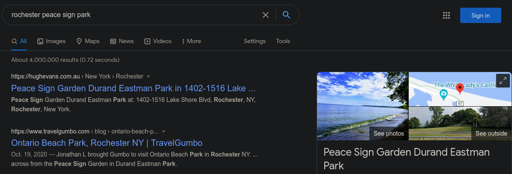
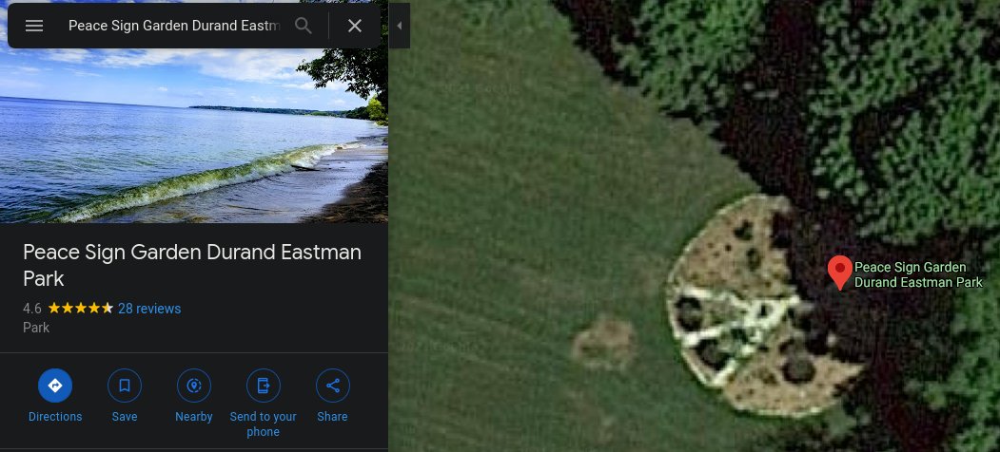
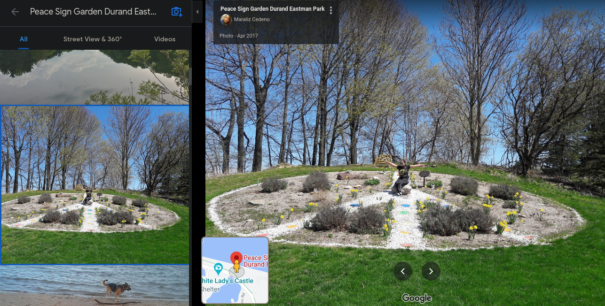

# #OSINTChallenge

Please DO NOT attempt to reset the password for any accounts or social engineer the characters. We have taken action to prevent this in the future and your activity will likely be flagged as malicious by the account providers.

Please DO NOT like, follow, connect with, or contact any characters on any platforms. You will not get a response and it will not help you solve the challenge.

The CEO of Geno’s company loves local art and nature. Where was she when she took the photo in her Twitter background? (Wrap the answer in RS{} and use underscores between each word.)

Author: FrozenTundras

## Solution

If we look back to Geno's Linkedin page from the "Finding Geno" challenge, we can see that his company's Linkedin page is linked:

By following this link, we can identify the CEO as Dr. JoAnne Turner-Frey:

From her name, we can search for her Twitter account:

Her profile is the one with the matching name and profile picture.

On her profile, we can see the image in question.
We also see that she is a resident of Rochester, New York, USA.

The challenge specifies that she loves local art and nature, so we can assume that the picture is taken from or near Rochester.
Using this information, we can search for the location and details of the image:

Following the Google Maps preview, we can see that this is the same place as in the Twitter banner:

The features in the image are identical to the features in JoAnne Turner-Frey's Twitter profile.
We can be confident that the photo was taken in Durand Eastman Park.

## Flag

`RS{Durand_Eastman_Park}`

