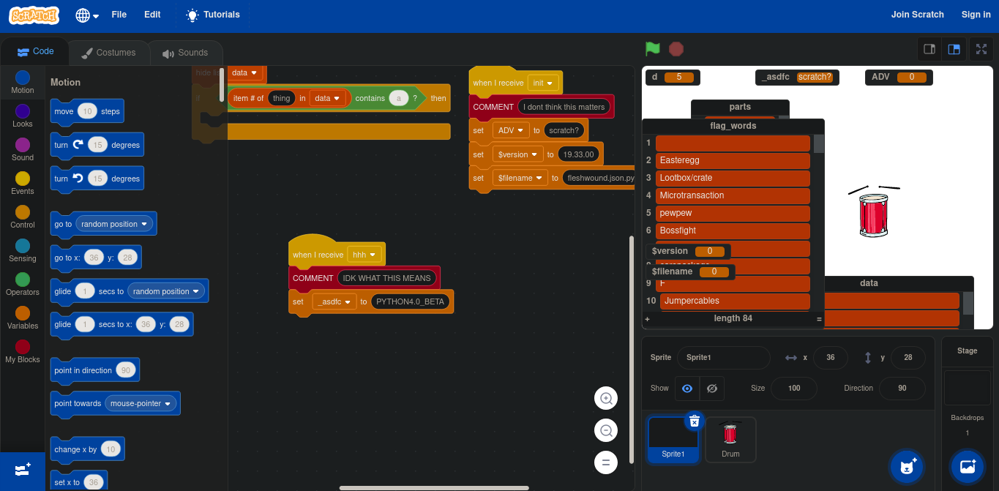
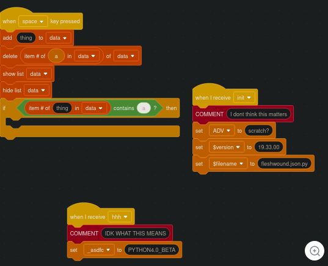
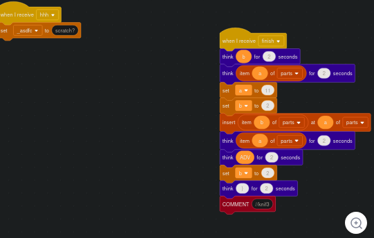
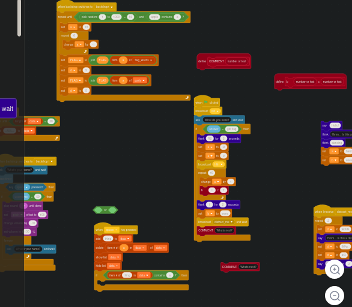
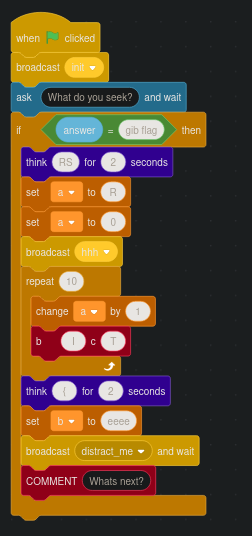
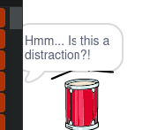
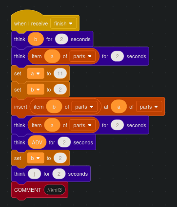
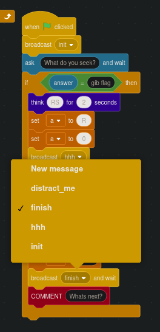

# Fleshwound

Tis but a....

~knif3

## Challenge

We're given an obfuscated and broken Scratch program as a json file.

### Loading the program into Scratch

We can load the program into https://scratch.mit.edu/projects/editor/?tutorial=getStarted as a normal Scratch project:

The project contains the default Sprite1, a Drum sprite, and the default Stage.

### Sprite1 code

### Drum code

### Stage code

## Solution

If we look at the entry function, we can see that it expects the string "gib flag".

By entering this function, the program beings to print the flag, but stops after `RS{` and prints garbage:

We can see that the Drum sprite code contains a function to print the rest of the flag on the `finish` signal.

We can replace the `distract_me` signal with the `finish` signal to avoid the distration and print the rest of the flag.

## Flag

`RS{eeee_whats_th@t_scratch?}`

